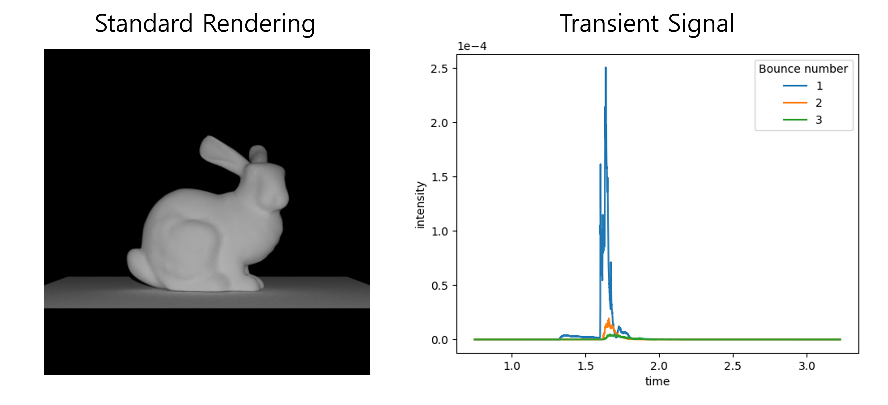

# MitsubaPyOptiXTransient
This repository is the official data generation code for "Neural Volumetric Reconstructions for Coherent Synthetic Aperture Sonar" by Albert Reed, Juhyeon Kim, Thomas Blanford, Adithya Pediredla, Daniel C.Brown, Suren Jayasuriya (SIGGRAPH 2023).

Please also check main code for paper at [here](https://github.com/awreed/Neural-Volumetric-Reconstruction-for-Coherent-SAS).



## Renderer Overview

This is a custom python, GPU(OptiX)-based transient path tracing engine that renders Mitsuba formatted scenes which is built based on my previous custom [renderer](https://github.com/juhyeonkim95/MitsubaPyOptiX).

We implemented transient rendering using atomic operation on CUDA.

## Install
Please refer [here](https://github.com/juhyeonkim95/MitsubaPyOptiX) to install the renderer.

## Usage
```
python main_transient.py ../configs_transient_example/bunny.json
```
